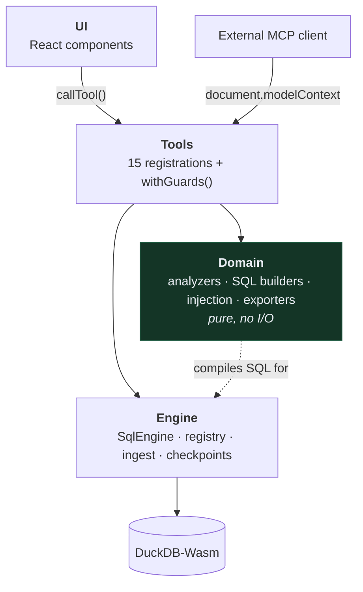
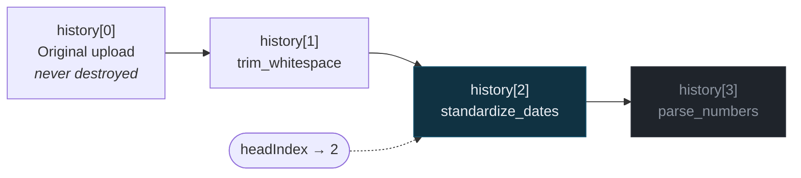

# Architecture

Four layers. Each one can be understood and tested without the layer above it.

```
┌──────────────────────────────────────────────────────────┐
│  UI            React components                          │
│                calls tools via callTool()                │
├──────────────────────────────────────────────────────────┤
│  Tools         15 WebMCP tools + withGuards() middleware │
│                registered on document.modelContext       │
├──────────────────────────────────────────────────────────┤
│  Domain        pure functions — analyzers, SQL builders, │
│                injection scanner, exporters. No I/O.     │
├──────────────────────────────────────────────────────────┤
│  Engine        DuckDB-Wasm, dataset registry, ingest,    │
│                checkpoints. Knows nothing about MCP.     │
└──────────────────────────────────────────────────────────┘
```



Arrows point one way only. The domain layer knows nothing about tools, and the
engine knows nothing about MCP.

The **domain layer is pure** — no WASM, no async I/O. That is why most of the
suite runs in milliseconds and why the analyzers and exporters are easy to test
exhaustively.

## The one rule worth stating

**The UI and the agent call the same function.**

`useWebMCP` returns `{ state, execute, reset }`, so the component that renders a
button invokes the identical registered tool an agent invokes. There is no
parallel "UI path" that could drift from the tool surface. When the app shows
you a preview, it is the preview the agent would have received.

## Engine

`SqlEngine` is a four-method interface: `query`, `registerFileText`, `dropFile`,
`close`. Everything above depends on that, never on DuckDB directly.

This exists for a concrete reason: the browser and the Node test harness
bootstrap DuckDB in incompatible ways. The browser uses the async worker-backed
build via a Blob URL shim; Node uses the **blocking** bindings, which need no
worker at all. Neither the domain layer nor the tools notice.

### Ingest

CSVs load as:

```sql
CREATE TABLE … AS SELECT * FROM read_csv(file,
  all_varchar=true, header=true, sample_size=-1, ignore_errors=true)
```

`all_varchar=true` is the important one. A cleaning tool must not let the
database coerce or reject malformed values on the way in — the inconsistent
dates and currency strings are what the user is here to find. Typing becomes a
transformation they opt into.

`ignore_errors=true` keeps one bad line from rejecting a whole file, but it
drops rows silently. So ingest independently counts the records the file claims
to hold (`countCsvRecords`, quote-aware) and reports the difference. Losing rows
without saying so would be the worst possible failure for this product.

### Checkpoints

A dataset is an append-only `history` plus a `headIndex`. Each checkpoint is a
real DuckDB table.

- Applying a change materializes a new table and appends.
- Undo moves `headIndex`. Nothing is deleted, so redo works.
- `history[0]` is the original upload and is never destroyed.



Each node is a real DuckDB table. Undo moves the pointer left, redo moves it
right, and nothing is recomputed — which is why both are instant. `history[3]`
above is dimmed because it has been undone, not deleted: it is still reachable.

Applying a change while rewound discards the abandoned branch — editor
undo/redo semantics — and returns the orphaned tables so they can be dropped.

## Domain

Seven analyzers, each independent. One failing on an unusual column returns
empty rather than sinking the whole report; a partial report beats an error
page.

Transformations compile to SQL through `compileTransform()`, which returns the
SELECT, the resulting columns, a description, and an **impact query** counting
rows the operation will change. That impact query is what makes a preview
measured rather than estimated.

Two rules hold across every operation:

- **Nothing is destroyed to make a column look tidy.** A date that cannot be
  parsed is left exactly as it was. The final `COALESCE` arm is the original
  value. A tidy column full of silently discarded data is worse than a visibly
  messy one.
- **Every operation reports its own impact** before it runs.

Operations involving a judgement call carry a `caveat` that surfaces in the
approval dialog — date ordering, decimal separators, outlier clipping.

## Tools

Each tool is a `ToolDefinition`: name, description, JSON Schema, annotations,
and an `execute` wrapped by `withGuards()`. One definition serves three
consumers — WebMCP registration, the Tool Inspector, and the demo agent — which
is what guarantees the schema a reviewer inspects is the schema an agent is
offered.

Schemas are written twice on purpose: JSON Schema for advertisement, Zod for
execution. A client may ignore the advertised schema, so validation cannot
depend on it having been honoured. They sit adjacent in `schemas.ts` so drift is
visible in review.

## Agents

Both agents are async generators yielding events, resumable with a decision:

```ts
type AgentRun = AsyncGenerator<AgentEvent, void, boolean | undefined>;
```

That shape puts the human gate in the control flow. An agent cannot apply a
change without the consumer handing back an approval — it is not a convention
each implementation must remember.

## Why Vite and not Next.js

Every capability here is browser-only: WebMCP registers on `document`, DuckDB
runs in a worker. SSR would add hydration hazards around WASM boot and buy
nothing. The build is a static bundle that deploys anywhere.

## Testing

| Suite | What runs |
|---|---|
| `tests/unit` | domain layer + guards. Pure, milliseconds. |
| `tests/integration` | real DuckDB-Wasm via Node bindings. No mock DB. |
| `tests/evals` | security behaviour, asserted by observable effect. |

The integration suite runs the genuine engine because the interesting bugs live
in the SQL — a mock would have happily accepted every broken query written
during this build.
